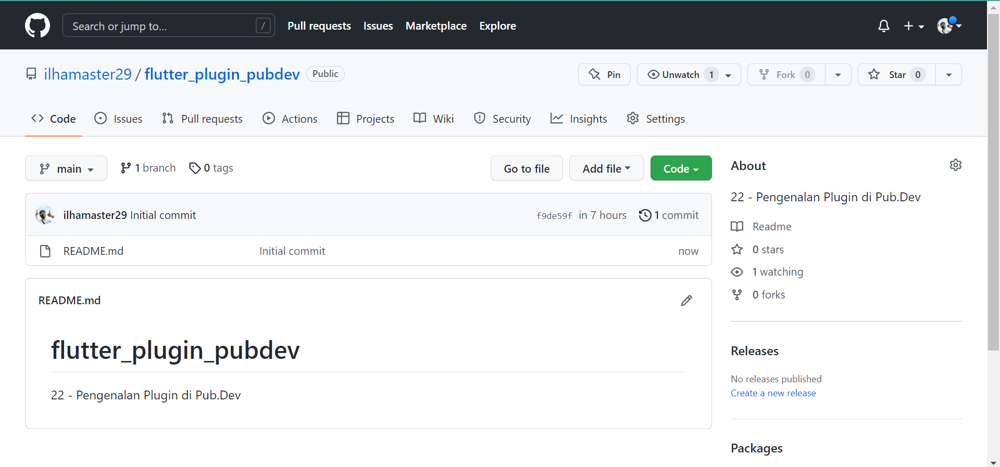
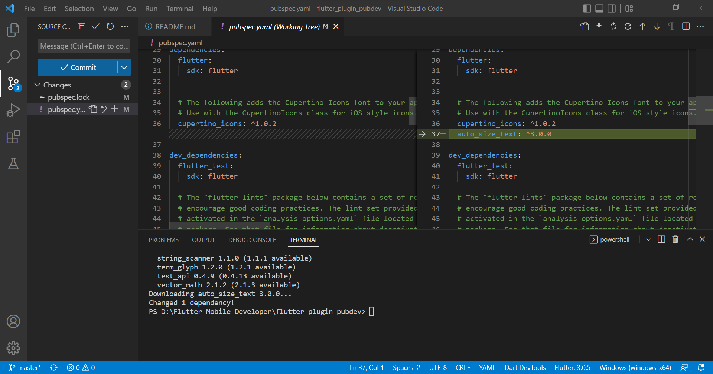
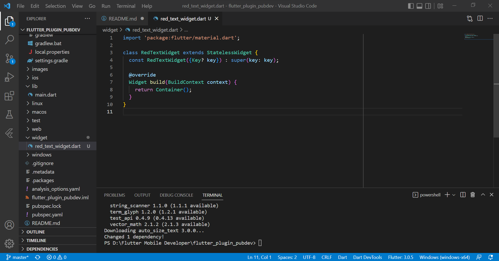
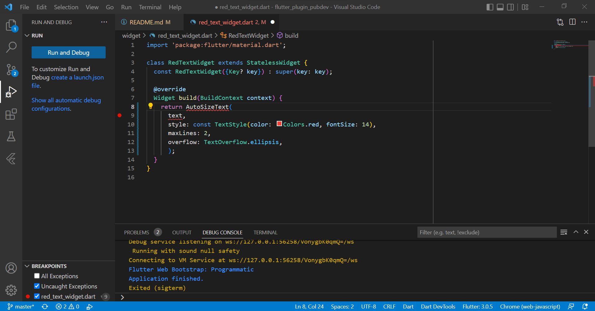
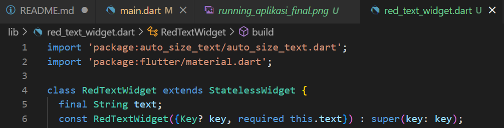
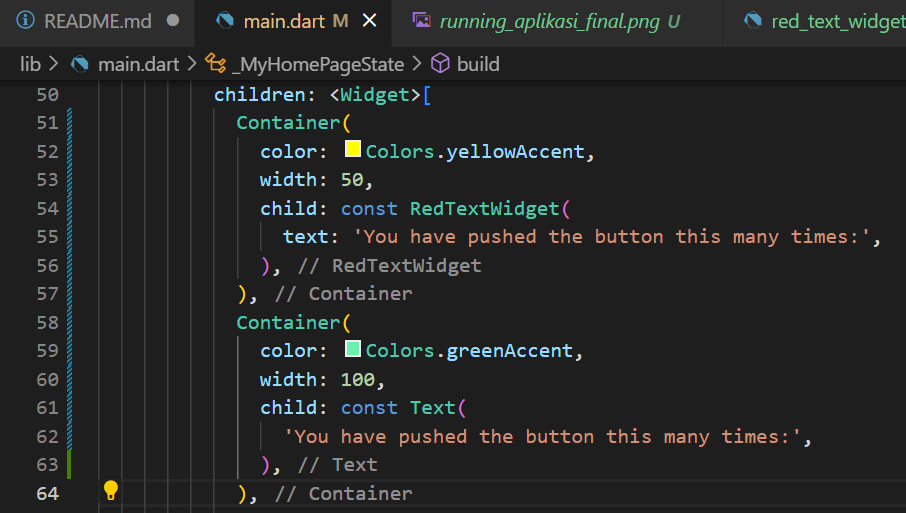
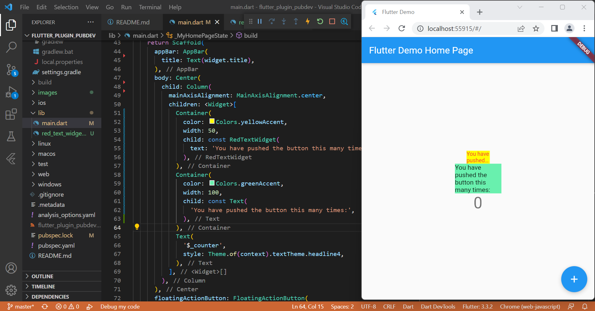

# Laporan Praktikum

## 1. Buat Project Baru

- Project Baru di vscode

> Pembuatan _project baru_ bernama **flutter_plugin_pubdev** di aplikasi vscode.

- Repository baru di GitHub

> Pembuatan repository baru bernama **flutter_plugin_pubdev** di GitHub.

## 2. Menambahkan Plugin

> Penambahan plugin lewat terminal. Gambar diatas merupakan *before* (gambar kiri) dan *after* (gambar kanan) setelah perintah **flutter pub add auto_size_text** dijalankan pada terminal.

## 3. Buat file red_text_widget.dart

> Pembuatan file red_text_widget.dart di _project_ **flutter_plugin_pubdev**.

## 4. Tambah Widget AutoSizeText

> Tampilan kode setelah auto size text ditambahkan, terdapat *error* pada tulisan ***AutoSizeText*** dan ***text***. *Error* ini disebabkan karena library auto size text belum dipanggil.

## 5. Buat Variabel text dan parameter di constructor

> Langkah ini bertujuan untuk mengatur tipe data dan membuat _constructor_ untuk text yang berwarna merah.

## 6. Tambahkan widget di main.dart

> Pada widget pertama terdapat parameter :
- Parameter color berfungsi mengatur warna _background_ teks. 
- Parameter width berfungsi mengatur lebar _background_ teks.
- Parameter child berfungsi memasukkan RedTextWidget ke dalam widget container. 

> Pada widget kedua terdapat parameter :
- Parameter color berfungsi mengatur warna _background_ teks. 
- Parameter width berfungsi mengatur lebar _background_ teks.
- Parameter child berfungsi memasukkan Text ke dalam widget container. 

Perbedaan ada pada parameter child. pada widget pertama (atas), widget **child** memunculkan atribut **RedTextWidget** dari **file red_text_widget.dart**. Sedangkan pada widget kedua (bawah), widget child memunculkan Text tanpa atribut.

## Running aplikasi final

> Pada _running final_ aplikasi, dapat dilihat bahwa pada tulisan "You have pushed the button this many times:" yang atas berwarna merah dan memiliki background berwarna kuning. Ini disebabkan oleh warna text yang sudah diatur warna dari pengimportan widget **RedTextWidget** pada **file main.dart**. Untuk lebar sendiri diberi nilai 50. 

> Sedangkan pada tulisan "You have pushed the button this many times:" yang bawah, teks tetap berwarna hitam dan background berwarna hijau karena pada kode dicantumkan perintah **color: Colors.greenAccent**. Untuk lebar sendiri diberi nilai 100.