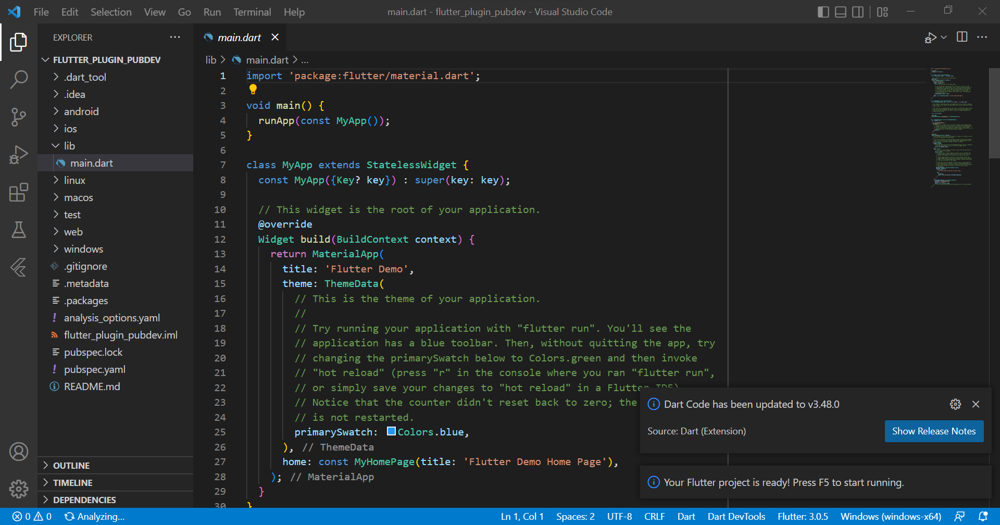

# Laporan Praktikum

## 1. Buat Project Baru

- Project Baru di vscode

Pembuatan project baru bernama **flutter_plugin_pubdev** di aplikasi vscode.

- Repository baru di GitHub

Pembuatan repository baru bernama **flutter_plugin_pubdev** di GitHub.

## 2. Menambahkan Plugin

Penambahan plugin lewat terminal. Gambar diatas merupakan *before* (gambar kiri) dan *after* (gambar kanan) setelah perintah **flutter pub add auto_size_text** dijalankan pada terminal.

## 3. Buat file red_text_widget.dart

